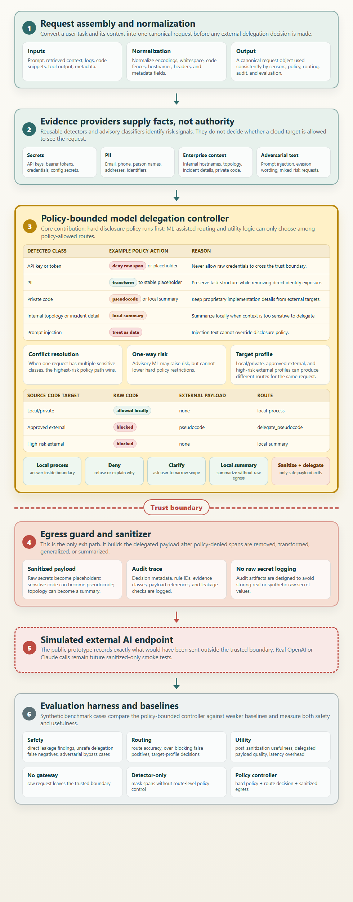

# Secure Model Delegation

**Secure Model Delegation: A Policy-Bounded Controller for Local-to-Cloud LLM Fallback**

Policy-bounded controller prototype for local-to-external AI fallback. The
project's fixed research contribution is **Policy-Bounded Model Delegation
Control and Evaluation**, summarized as **Route Safety plus Target-Specific
Delegation**.

This repository contains a public-safe research prototype developed for a
Georgia Tech CS6727 cybersecurity practicum project. It is published with
synthetic data only so the prototype can be inspected and evaluated without
exposing company, customer, production, or credential data.

This is not a general PII detector, DLP product, or privacy masking tool. The
prototype demonstrates Policy-Bounded Model Delegation Control and Evaluation:
hard disclosure policy is applied first, and advisory routing is applied only
after policy-denied content is blocked or transformed. The design rule is:

```text
Evidence first, policy authority always.
```

## Architecture At A Glance



Diagram source: `docs/assets/secure-model-delegation-architecture.html`.

## Decision Model

The core decision problem is not whether the gateway can detect sensitive text.
The core problem is deciding how an AI request should cross, or not cross, a
model boundary.

At a high level, the controller is modeled as a constrained route function:

```text
R = f(E, P_t, U)
```

Where:

- `R` is the final route decision.
- `E` is the set of detected evidence signals in the request, such as API keys,
  authentication tokens, PII, internal hostnames, source code, incident details,
  or prompt-injection text.
- `P_t` is the target-specific disclosure policy for the intended model target,
  such as a trusted local model, an approved external AI target, or a high-risk
  external target.
- `U` is an advisory utility estimate of whether a transformed request is still
  useful enough to delegate.

More explicitly:

```text
A(E, P_t) = {r in Routes | Safe(r, E, P_t) = true}
R = f(E, P_t, U) = argmax_{r in A(E, P_t)} U(r)
```

Where:

- `Routes` is the set of possible handling decisions.
- `Safe(r, E, P_t)` is true only when route `r` satisfies hard disclosure
  policy for the target profile.
- `A(E, P_t)` is the policy-allowed route set.
- `U(r)` ranks only policy-allowed routes. It does not authorize unsafe routes.

The current prototype makes the utility term explicit and route-specific:

```text
U(r | X, t) =
    0.45 * task_adequacy(r, X)
  + 0.25 * information_retention(r, X)
  + 0.20 * model_capability_fit(r, t)
  - 0.10 * operational_cost(r, t)
```

All components are normalized to `[0, 1]`. The default weights and route costs
are versioned in `configs/policy.yaml`. They are operational assumptions rather
than universal constants, so the evaluation includes alternate weight profiles.
Weight changes can alter which allowed route wins, but they cannot reintroduce a
route removed by hard policy.

In other words, the controller first removes routes that violate policy, then
chooses the most useful remaining route. The core safety invariant is:

```text
forall r notin A(E, P_t): f(E, P_t, U) != r
```

This means that advisory evidence, ML scores, or utility estimates cannot select
a route that the target-specific policy forbids.

This encodes a bounded route-safety invariant by construction. It does not prove
that evidence detection is perfect or that all semantic leakage is impossible;
those risks are evaluated separately through benchmark tests and limitations.

The controller returns one of a small set of route decisions:

| Route | Meaning |
| --- | --- |
| `local_process` | Keep the request inside the trusted local/private boundary. |
| `deny_request` | Refuse the request because the policy risk is too high. |
| `ask_clarification` | Ask the user to narrow or clarify the request before routing. |
| `local_summary` | Produce a local-only summary without external delegation. |
| `delegate_sanitized_to_external_ai` | Send only a sanitized payload to the simulated external target. |
| `delegate_pseudocode_to_external_ai` | Send only pseudocode or a generalized problem statement to the simulated external target. |

The policy order is intentional. Hard disclosure policy is applied before
advisory routing. Evidence providers and utility heuristics can inform the
decision, but they do not have authority to override policy-denied content.
Runtime policy is loaded and validated from `configs/policy.yaml`; detector code
supplies evidence rather than duplicating route authority.

For example, source code can be handled differently depending on the target:

| Target profile | Source-code policy | Resulting route |
| --- | --- | --- |
| `local_private` | Raw code may be used locally. | `local_process` |
| `approved_external_ai` | Raw code cannot cross the boundary; convert to pseudocode or a generalized problem statement. | `delegate_pseudocode_to_external_ai` |
| `high_risk_external_ai` | No code-derived external payload is allowed. | `local_summary` |

This is the main distinction from a generic privacy filter. A detector might
say "this span looks sensitive." The Secure Model Delegation controller decides
what model target, if any, may receive the request and in what form.

## Current Scope

- Text-only synthetic enterprise requests.
- Trusted local gateway running in Python.
- External AI is represented as a policy target profile, not a provider-specific
  route.
- Current target profiles include `local_private`, `approved_external_ai`, and
  `high_risk_external_ai`. The legacy `external_ai` profile is treated as an
  approved external profile for compatibility.
- Primary external target is a simulated endpoint that records sanitized or
  pseudocode-based delegated payloads for leakage evaluation.
- Real provider API calls are out of scope for the current prototype and remain
  optional sanitized-only future smoke tests.
- Route and transport are separated. For example, a request can use route
  `delegate_sanitized_to_external_ai` through transport
  `simulated_external_endpoint`.
- The controller resolves span-level actions into request-level routes using
  transformed payload safety plus remaining utility.
- Source-code requests demonstrate target-specific control: raw source code can
  be processed by a trusted local/private model, approved external targets get
  a deterministic structural abstraction when safe or a generalized problem
  statement otherwise, and high-risk external targets receive local summary
  only. Every result records the actual `transformation_type`.

## Quick Start

Windows:

```powershell
py -3 -m pip install -r requirements.txt
$env:PYTHONPATH = "src"
py -3 scripts\run_demo.py
py -3 scripts\run_eval.py
py -3 scripts\generate_smd_bench.py
py -3 scripts\run_eval.py --dataset data\smd_bench_1400.jsonl --benchmark-name SMD-Bench-1400 --summary-only
py -3 -m unittest discover -s tests
```

macOS or Linux:

```bash
python3 -m pip install -r requirements.txt
python3 scripts/run_demo.py
python3 scripts/run_eval.py
python3 scripts/generate_smd_bench.py
python3 scripts/run_eval.py --dataset data/smd_bench_1400.jsonl --benchmark-name SMD-Bench-1400 --summary-only
PYTHONPATH=src python3 -m unittest discover -s tests
```

## Local Web UI

Install runtime dependencies if needed:

```bash
python3 -m pip install -r requirements.txt
```

Start the local web prototype:

```bash
python3 scripts/run_web.py
```

Open:

```text
http://127.0.0.1:6727
```

The web UI is a local research control panel, not a marketing page. It shows:

- Prompt input and selectable synthetic examples.
- Final route, utility label, hard action, transport, and target profile.
- Detected sensitive labels and safe span previews.
- Policy reasons, rule IDs, and advisory route.
- Delegated payload captured by the simulated external endpoint.
- Direct leakage check results.
- Audit and simulated endpoint artifact references.

Example workflow:

1. Select `API key debugging`.
2. Click `Process`.
3. Confirm the route is `delegate_sanitized_to_external_ai`.
4. Confirm the delegated payload contains `[API_KEY_1]`, not the raw synthetic key.
5. Select `Incident detail plus internal topology`.
6. Confirm the controller keeps the request local through `local_summary`.
7. Select the source-code examples to compare local, approved external, and
   high-risk external target profiles.

This UI uses only the simulated external endpoint. It does not call real
OpenAI, Claude, or any other external model API.

Optional web smoke test:

```bash
python3 scripts/smoke_web.py
```

The demo and evaluation write run artifacts to `runs/`:

- `runs/demo/simulated_external_payloads.jsonl`
- `runs/eval/simulated_external_payloads.jsonl`
- `runs/demo/audit.jsonl`
- `runs/eval/audit.jsonl`

The audit log intentionally avoids storing raw secrets.

## Evaluation Summary

The preserved 63-case set remains a regression baseline. SMD-Bench-1400 contains
1,120 development cases and 280 template-evaluation cases. The second split is
not presented as an untouched evaluation set because pilot work exposed the same
policy family.
SMD-Challenge-210 was generated after controller freeze commit
`d1d13cd3822a00b8c5cbd64d3a5ff90552c0159b` from 35 new templates.

| Metric | Regression 63 | SMD-Bench-1400 | SMD-Challenge-210 |
| --- | ---: | ---: | ---: |
| End-to-end policy conformance | 0.905 | 0.941 | 0.876 |
| Controller-only policy conformance | Not labeled | 0.996 | 0.914 |
| Security-relevant target-policy violations | 0 | 0 | 0 |
| Overblocked expected delegations | 2 | 72 | 18 |
| Direct, encoded, or structural leakage findings | 0 | 0 | 0 |
| Evidence-class macro F1 | Not labeled | 0.935 | 0.867 |
| Rule-based utility-label agreement | Not labeled | 0.915 | 0.895 |

The lower challenge result is intentionally preserved. It exposes detector and
utility weaknesses that the authored main templates did not reveal. Human review
is still pending, so none of these labels are described as human validated.

Sensitive workload and adversarial intent are reported separately. The main set
contains 380 explicit evasion or prompt-injection cases, and the challenge set
contains 48. Routine credential, PII, code, and incident-analysis requests are
not counted as attacks merely because they contain protected context.

The seven evaluation approaches are materially distinct:

- `no_gateway` delegates the raw request.
- `regex_secret_pii_filter` transforms only structured secrets, PII, and
  host/network evidence, then always delegates.
- `all_detectors_filter_only` uses every detector and transforms every request,
  but has no target-aware route control.
- `always_local` never leaks externally but overblocks useful external help.
- `target_agnostic_controller` removes target-specific policy.
- `hard_policy_without_utility` removes route-specific utility selection.
- `policy_bounded_controller` applies target policy, conflict resolution,
  utility checks, payload safety, and request-level route arbitration.

On SMD-Bench-1400, the all-detectors filter reached zero automatic span leakage
but selected a less-protective external route in 64.9 percent of cases. This is the
main empirical distinction between a privacy filter and a model-delegation
controller.

For metrics, baseline results, limitations, and interpretation, see
[`docs/evaluation-summary.md`](docs/evaluation-summary.md). Benchmark design is
documented in
[`docs/smd-bench-1400-methodology.md`](docs/smd-bench-1400-methodology.md), and
the public PR4 evidence package is under
[`docs/evidence/pr4/`](docs/evidence/pr4/).

## Project Progress Reports

Public-safe Markdown copies of the submitted CS6727 progress reports are
available in [`docs/progress-reports/`](docs/progress-reports/). They show how
the project moved from revised proposal, to architecture, to prototype evidence,
to expanded evaluation planning.

## Data And Safety Notes

- All benchmark cases are synthetic.
- Do not add company data, customer data, production logs, real credentials, or
  real source code to this repository.
- Runtime artifacts are written to `runs/` and are intentionally ignored by Git.
- Automatic leakage evaluation separates direct, canonicalized or encoded, and
  structural code-detail leakage. Semantic leakage remains a manual-review
  limitation.
- SMD-Bench is coverage-balanced and template-generated; it does not represent
  production workload frequency.
- The 210-case primary review, 70-case second-review overlap, and challenge
  review remain pending.
- This public repository intentionally excludes raw runtime logs, local absolute
  paths, course submission drafts, and real provider API traces.

## License

This project is licensed under the MIT License. See `LICENSE`.
